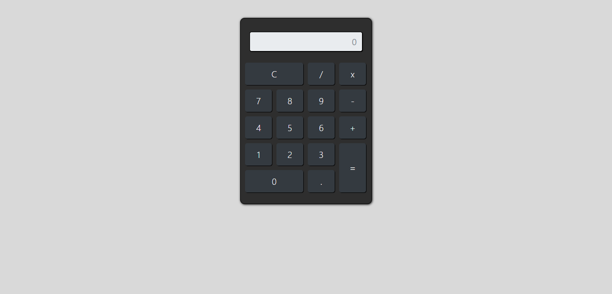

# App Calculadora
Projeto criado através da plataforma Udemy no curso Desenvolvimento Web Completo.
## Deploy da aplicação

https://appcal.netlify.app/

## Tecnologias utilizadas

+ HTML5
+ CSS3
+ Bootstrap
+ JavaScript

## Estrutura do site

+ Calculadora: Seção onde é possível utilizar das funcionalidades da calculadora.

## Tela Inicial

